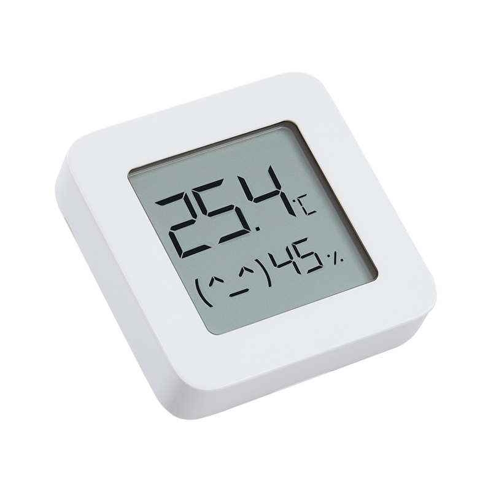

# mitemperature2-exporter

Prometheus exporter for **Mijia Bluetooth Thermometer**

## Get started

TODO

## Metrics
| Name                    | Description       | Example  |
| ----------------------- | -------------     | -------------|
| mitemperature2_exporter |   version         | 1|
| mi_temperature          |   temperature     | 19.1|
| mi_humidity             |   humidity        | 70.79|
| mi_battery_voltage      |   battery voltage | 2.746|
| mi_battery_percent      |   battery percent | 60|
| mi_rssi                 |   rssi            | -50|

## Credits

- https://github.com/JsBergbau/MiTemperature2
- https://pvvx.github.io/ATC_MiThermometer/TelinkMiFlasher.html
